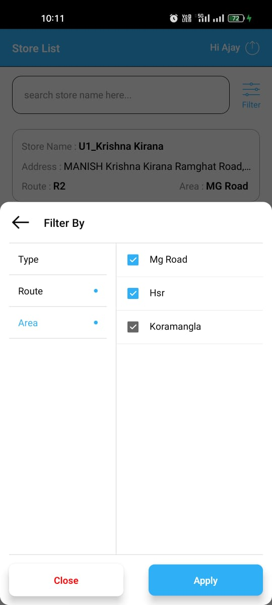

# Kirana Club | React Native Assignment

> **App link**:

> [Retail Pulse App](https://drive.google.com/file/d/1z65a6tHSNUxel6LtP_hLy36ZsqsF6q0S/view?usp=sharing.)

## App Flow

- Login using username and password.
- After login Complete Landing to the Store list screen.
  - Lazy loading implemented for scroll the list.
  - Search Feature to search the store.
  - Filter Modal - Dynamic fields in Store Data.
  - Inline Applied Filters , Clear Filter Option.
- Store Details Screen
  - List of Already Uploaded Images
  - given option to Upload Images via Camera, Select from Gallery.
  - Preview the Images and upload to Cloud.
- User can logout - Logout option in Header.

## Technology used

- React Native.
- firebase - database.
- firebase - Cloud Storage.
- AsyncStorage - to store login user data.

## Features

- **store search feature**
- Filters to filter the store list, the values can be taken from the store attributes. (Area, Type, Route, etc) dynamic.
- Upload **image** and **Listing the Uploaded Image for Perticular store**

## Screen Recording

## Screen shots

